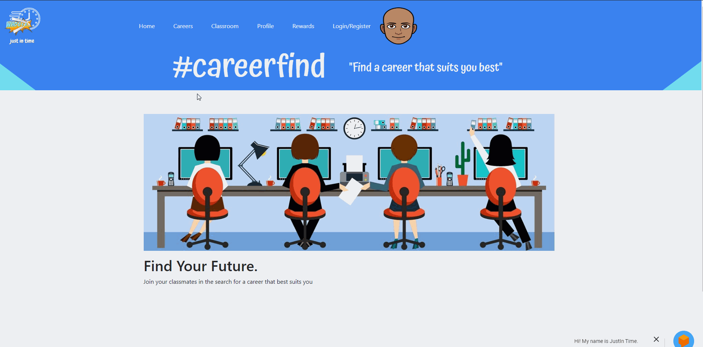

# Just In Time
The basic idea of this project is to help students find a career. The website provides answers to questions about their interest and finds a matching career based on their interest. 

The technology used in this project is MERN Stack.

## _**Demo**_

## 

•	Homepage
•	Career Suggestion
•	Chatbot
•	Edit/Buy Avatar
•	Rewards Section
•	Edit Profile
•	Class Suggestion
•	Question for Finding career
•	Career Splash cards
•	Career Favoriting
•	React Bootstrap API
•	Passport API
•	Libmoji API
•	CareerOnestop API
•	SnatchBot API

https://desolate-tundra-47350.herokuapp.com/